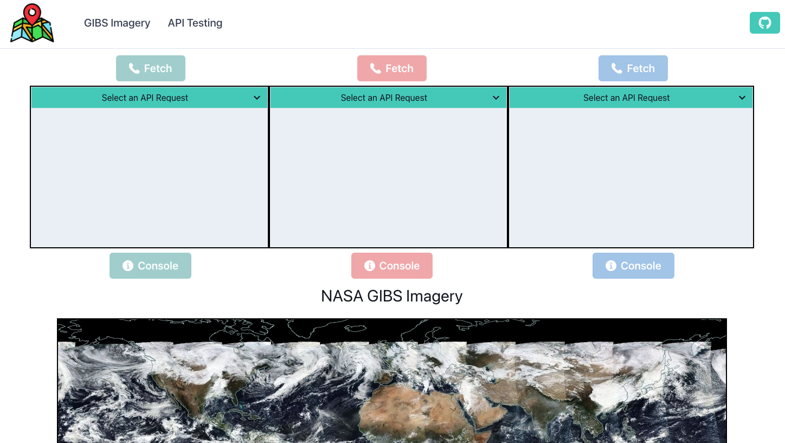

# Worldview React Testing Demo

## About
This is a very simplified demo that mimics some of the functionality of the [NASA GIBS Worldview application](https://github.com/nasa-gibs/worldview). This can be used for testing the ability to add new features to Worldview. It has very basic functionality including adding & removing layers, toggling visibility of layers, changing layer dates and reordering layers. It is preconfigured with 7 layers but includes a config file where you can add more. This currently only works with Raster layers. There is a seperate route `/apitesting` where you can configure and test API calls.

## Technologies
* Typescript
* React
* Redux
* Chakra UI

## Instructions
* `npm install`
* `npm start`
* To add additional layers go to `/src/worldview/config` to find the layer you want to add. Add the required data to `/src/worldview/availableLayers` as a object to the end of the array. 
* To test additional API routes go to `/src/worldview/apiConfig` and add the required information to a new object at the end of the `apiCalls` array.
* This project was written with Typescript but is set to the least strict type checking setting so you should be able to add js/jsx files and write Javascript.  

### Created By:

